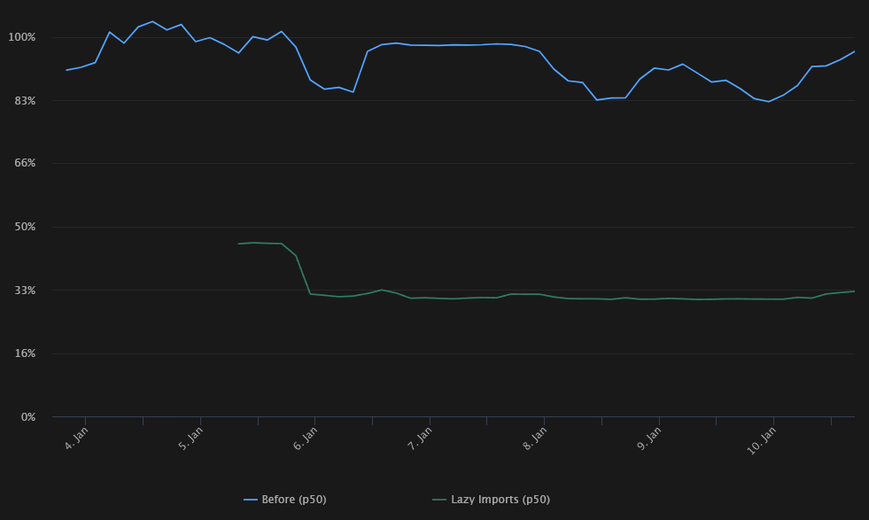
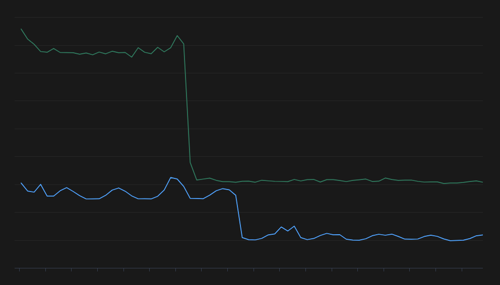

Lazy Imports
============

Fast iteration cycle is one of the reasons that Python is loved by developers.
However, in large and complex codebases, we’ve found that Python encounters a
serious usability problem, where just starting an application may take a long
time (*minutes* in some cases!), due to spending a lot of time executing
imports and module-level code at import time.

We developed a runtime-level feature in Cinder that provides a transparent and
robust mechanism for lazy loading imports (e.g., deferring loading and
executing imported modules from the time of import to the time of first use).

Lazy Import is not enabled by default, since it introduces changes in semantics
that may be unexpected. When enabling Lazy Imports in Meta, we have observed
improvements in startup time (and total runtime for some CLI tools) in the
range of 40%-70%, as well as significant reduction in memory footprint
(up to 40%), thanks to not needing to resolve some of the deferred imports
that end up being unused in the common flow.

Results
-------

We originally rolled out lazy imports to thousands of Instagram production and
development hosts in January 2022, and measured the impact.

Instagram Server:

- P50 reload times reduced by ~70%
- P90 reload times reduced by ~60%
- ~12x fewer modules were loaded!
- There was a small negative impact in "first request latency", as expected

Instagram Shell (Django Shell with some internal tweaks) startup time improved
more than 5x, loading about 4x fewer modules.

A few other Instagram CLI tools saw reduction in startup time ranging from 30%
to 70%, as measured when running the tool with the ``--help`` flag.

MySQL Power Loss Siren handler script (see `more details about Power Loss Siren <https://engineering.fb.com/2021/12/16/data-center-engineering/power-loss-siren/>`_)
overall P90 runtime was reduced by 11s, which is the difference between missing
its 45s SLA and meeting it with a wide margin.

`Bento <https://developers.facebook.com/blog/post/2021/09/20/eli5-bento-interactive-notebook-empowers-development-collaboration-best-practices/>`_,
Meta’s internal version of Jupyter, experienced between 50% to 70% reduction in
startup time, across multiple Python kernels.

The F3 compiler, for AI feature training, is showing over 30% reduction in
memory usage during preliminary experimentation.

Tupperware CLI, one of the tools for managing and orchestrating containerized
workloads, is showing 2x speedup in overall runtime of a command performing
Thrift RPC calls during preliminary experimentation.

Implementation Details
----------------------

Lazy imports is implemented as a language level feature in C, and all this
happens transparently for the Python code. Python modules will never see the
deferred objects which live deep down in CPython (Cinder) internals, mostly
in the dictionary that holds the globals.

Each ``import`` and ``import from`` in the module’s top level is translated
to a *deferred object* name (in ``IMPORT_NAME`` and ``IMPORT_FROM`` python
opcodes, mainly), instead of directly and immediately loading the modules.
At some point, these *deferred objects* need to be transparently resolved.

The way *deferred objects* are reliably resolved when they're used is when the
dictionary where they live (yes, all variables internally live inside a Python
dictionary) is accessed to extract the name's value. Dictionaries that may
contain *deferred objects* get a special lookup function that checks for
*deferred objects* and resolves them. Because this only happens for
dictionaries that actually contain at least one deferred object (mostly just
module globals dictionaries), and the resolved objects replace the deferred
objects as soon as the import is resolved, the performance impact is minimal.

When the *Warmup* feature is enabled all deferred objects remaining unresolved
by the end of the module's execution are resolved, during the top level
``RETURN_VALUE`` opcode.

Usage
-----

Naturally, to use Cinder's Lazy Imports, you must use Cinder!

Lazy Imports can be manually enabled in any particular module by using:

.. code-block:: python

    from __future__ import lazy_imports

Lazy Imports can be enabled globally with the ``PYTHONLAZYIMPORTSALL``
environment variable, or by passing ``-X lazyimportsall`` to Python.

If enabled globally, all modules are loaded lazily. Lazy Imports can be
disabled for specific modules by adding a future-import:

.. code-block:: python

    from __future__ import eager_imports

In a production environment, where we’d want to have modules loaded and readily
available after the end of each module’s execution, we use the ***Warm Up***
feature, triggered by the ``PYTHONLAZYIMPORTSWARMUP`` environment variable or
by passing ``-X lazyimportswarmup`` to Python.

Issues and Gotchas
------------------

As described above, enabling Lazy Imports introduces changes in semantics that
may be unexpected.

- Any errors in imported modules (including ``ModuleNotFoundError``) will be
  deferred from import time to first-use time (and may even go unnoticed if
  not excercised during local development).
- Lazy Imports do not interact nicely with modules relying on import side
  effects (e.g., code executing logic that *needs* to happen "early" when
  being imported, implicit registration, and reliance on submodules being set
  as attributes on their imported parent module).
- Hackery around dynamic paths might behave incorrectly (e.g. imports that
  rely on hacking ``sys.path`` before and after the import).
- Applying type annotations may inadvertently defeat Lazy Imports.
  - Modules should use ``from __future__ import annotations``
  - Use string type annotations for ``typing.TypeVar()`` and ``typing.NewType()``
  - Wrap type aliases inside a ``TYPE_CHECKING`` conditional block

Ideally, reliance on Import Side Effects should lbe eliminated. If this is not
possible, you can force early imports in a few ways:

- By accessing the imported name or module (or assigning it to a variable).
- By moving the import to a try/except/finally block;
  imports inside these blocks are always imported eagerly.
- By using ``from __future__ import eager_imports``, at the top of the module,
  to force all imports in it to be imported eagerly. This does not apply
  recursively.
- Inner imports are also always eagerly imported.

An example of ``sys.path`` hackery that would throw ``ModuleNotFoundError``
when Lazy Imports are enabled:

.. code-block:: python

    sys.path.insert(0, "/path/to/foo/module")
    import foo
    del sys.path[0]
    foo.Bar()

Some best practices to deal with some of the issues:

- Avoid relying on Import Side Effects whenever possible
- Always import each module being used, don't rely on module objects having
  attributes to child submodules; i.e.: do ``import foo.bar; foo.bar.Baz``,
  not ``import foo; foo.bar.Baz``. The latter only works (unreliably) because
  the attribute ``bar`` in the module ``foo`` is added as an import side effect
  of ``foo.bar`` being imported somewhere else. With Lazy Imports this may not
  always happen on time.
- When possible, do not import whole submodules. Import specific names instead;
  i.e.: do ``from foo.bar import Baz`` , not ``import foo.bar`` and then
  ``foo.bar.Baz``. If you import submodules (such as ``foo.qux`` and
  ``foo.fred``), with Lazy Imports enabled, when you access the parent module's
  name (``foo`` in this case), that will trigger loading all of the sibling
  submodules of the parent module (``foo.bar``, ``foo.qux`` and ``foo.fred``),
  not only the one being accessed, because the parent module ``foo`` is the one
  being the deferred object name.
- Don't use *inner imports*, unless absolutely necessary. Circular imports
  should no longer be a big issue with Lazy Imports enabled, so there’s no need
  to add complexity or more opcodes in a potentially hot path.
- Always use ``from __future__ import annotations``  when possible. This way,
  modules that are imported only for typing purposes will never be loaded under
  Lazy Imports!
- Use string type annotations for ``typing.TypeVar()`` and ``typing.NewType()``.
  The reason is Python doesn't have postponed evaluation of types being used in
  these helper classes.
- Wrap type aliases inside a ``TYPE_CHECKING`` conditional block (only type
  aliases, there is no particular need to do type-only imports inside this
  block). The reason is Python doesn't support postponed evaluation of types
  for type aliases.

Prior Art
---------

- Python's ``importlib.util.LazyLoader``: https://docs.python.org/3/library/importlib.html#importlib.util.LazyLoader
- An approach to lazy importing in Python 3.7, originally described by Brett Cannon, using ``__getattr__()``: https://snarky.ca/lazy-importing-in-python-3-7/ (available as a library: https://modutil.readthedocs.io/en/latest/)
- DemandImport, derived from mercurial, delays loading of modules until they are used https://pypi.org/project/demandimport/
- Other internal Meta alternatives (``lazy_import``, ``lazy_import2``, ``lazy_import3`` utility functions)

Compared to these alternatives, Cinder Lazy Imports are more transparent (can work without changing user code) and complete.
