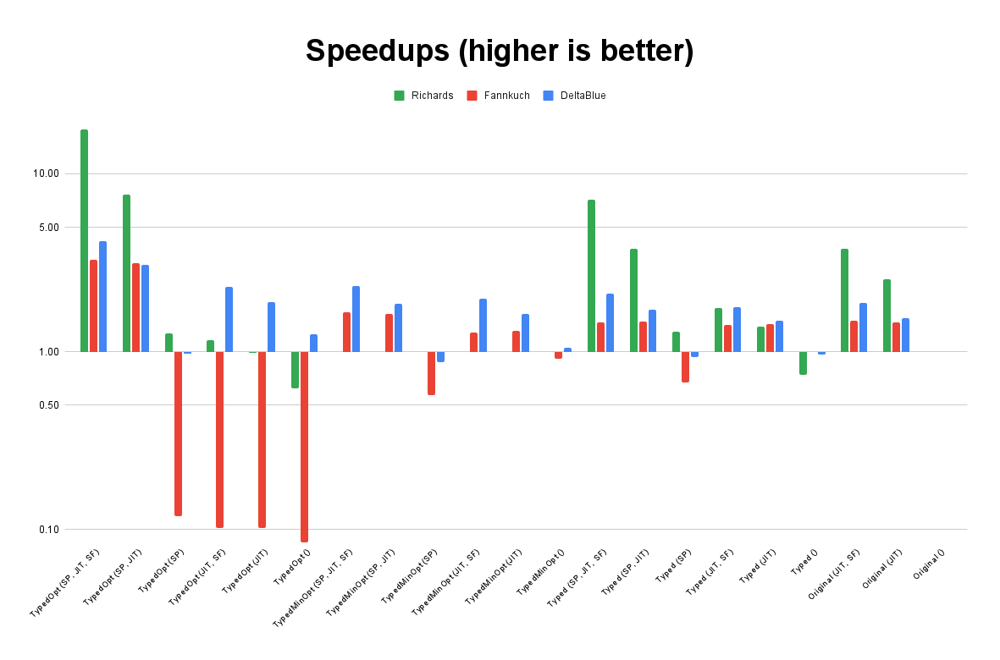

Static Python Benchmarks
========================

We ran a comprehensive benchmarking matrix, across three benchmarks,
covering multiple combinations of Cinder features and code changes.

Each benchmark has several versions of its code that accomplish the same work:
the Original untyped version, a Typed version which just adds type annotations
without otherwise changing the code, and a TypedOpt version converted to take
advantage of Static Python features for maximum performance under Static Python
and the JIT. Fannkuch and DeltaBlue also have TypedMinOpt, which uses just a
few Static Python specific features where it can be done in a targeted way
without significant changes to the code.

The other axes of our test matrix are SP (whether the Static Python compiler is
used), JIT (whether the Cinder JIT is enabled), and SF (whether the JIT
shadow-frame mode is enabled, which reduces Python frame allocation costs.)
The matrix is not full, since using the Static Python compiler on untyped code
has no noticeable effect, and shadow-frame mode is only relevant under the JIT.

This is a preview of the detailed benchmarks results,
which are pending publication.
We present below a normalized graph of "speedup" compared to "Original ()"
(e.g. "1" is original untyped version with no JIT enabled).
Values greater than 1 represent speedup in that benchmark configuration,
and values smaller than 1 represent slowdown in that benchmark configuration.
The graph is in log scale.

Raw data (normalized speedups) behind the graph:

+-----------+------------------------+--------------------+---------------+--------------------+----------------+-------------+---------------------------+-----------------------+------------------+-----------------------+-------------------+----------------+---------------------+-----------------+------------+-----------------+-------------+----------+--------------------+----------------+-------------+
|           | TypedOpt (SP, JIT, SF) | TypedOpt (SP, JIT) | TypedOpt (SP) | TypedOpt (JIT, SF) | TypedOpt (JIT) | TypedOpt () | TypedMinOpt (SP, JIT, SF) | TypedMinOpt (SP, JIT) | TypedMinOpt (SP) | TypedMinOpt (JIT, SF) | TypedMinOpt (JIT) | TypedMinOpt () | Typed (SP, JIT, SF) | Typed (SP, JIT) | Typed (SP) | Typed (JIT, SF) | Typed (JIT) | Typed () | Original (JIT, SF) | Original (JIT) | Original () |
+-----------+------------------------+--------------------+---------------+--------------------+----------------+-------------+---------------------------+-----------------------+------------------+-----------------------+-------------------+----------------+---------------------+-----------------+------------+-----------------+-------------+----------+--------------------+----------------+-------------+
| Richards  |                  17.74 |               7.63 |          1.27 |               1.16 |           0.98 |        0.62 |                           |                       |                  |                       |                   |                |                7.18 |            3.81 |       1.29 |            1.77 |        1.38 |     0.74 |               3.81 |           2.56 |           1 |
+-----------+------------------------+--------------------+---------------+--------------------+----------------+-------------+---------------------------+-----------------------+------------------+-----------------------+-------------------+----------------+---------------------+-----------------+------------+-----------------+-------------+----------+--------------------+----------------+-------------+
| Fannkuch  |                   3.28 |               3.14 |          0.12 |               0.10 |           0.10 |        0.08 |                      1.67 |                  1.63 |             0.57 |                  1.29 |              1.32 |           0.91 |                1.45 |            1.48 |       0.67 |            1.41 |        1.43 |     1.00 |               1.50 |           1.46 |           1 |
+-----------+------------------------+--------------------+---------------+--------------------+----------------+-------------+---------------------------+-----------------------+------------------+-----------------------+-------------------+----------------+---------------------+-----------------+------------+-----------------+-------------+----------+--------------------+----------------+-------------+
| DeltaBlue |                   4.20 |               3.07 |          0.97 |               2.32 |           1.89 |        1.25 |                      2.34 |                  1.86 |             0.87 |                  1.98 |              1.62 |           1.06 |                2.12 |            1.73 |       0.94 |            1.77 |        1.49 |     0.96 |               1.87 |           1.55 |           1 |
+-----------+------------------------+--------------------+---------------+--------------------+----------------+-------------+---------------------------+-----------------------+------------------+-----------------------+-------------------+----------------+---------------------+-----------------+------------+-----------------+-------------+----------+--------------------+----------------+-------------+

Raw data (average runtime in seconds over 10 runs, before normalization):

+-----------+------------------------+--------------------+---------------+--------------------+----------------+-------------+---------------------+-----------------+------------+-----------------+-------------+----------+---------------------------+-----------------------+------------------+-----------------------+-------------------+----------------+--------------------+----------------+-------------+
|           | TypedOpt (SP, JIT, SF) | TypedOpt (SP, JIT) | TypedOpt (SP) | TypedOpt (JIT, SF) | TypedOpt (JIT) | TypedOpt () | Typed (SP, JIT, SF) | Typed (SP, JIT) | Typed (SP) | Typed (JIT, SF) | Typed (JIT) | Typed () | TypedMinOpt (SP, JIT, SF) | TypedMinOpt (SP, JIT) | TypedMinOpt (SP) | TypedMinOpt (JIT, SF) | TypedMinOpt (JIT) | TypedMinOpt () | Original (JIT, SF) | Original (JIT) | Original () |
+-----------+------------------------+--------------------+---------------+--------------------+----------------+-------------+---------------------+-----------------+------------+-----------------+-------------+----------+---------------------------+-----------------------+------------------+-----------------------+-------------------+----------------+--------------------+----------------+-------------+
| Richards  |          0.567         |        1.319       |     7.938     |        8.635       |     10.267     |    16.134   |        1.401        |      2.642      |    7.805   |      5.688      |    7.308    |  13.602  |                           |                       |                  |                       |                   |                |        2.642       |      3.935     |    10.059   |
+-----------+------------------------+--------------------+---------------+--------------------+----------------+-------------+---------------------+-----------------+------------+-----------------+-------------+----------+---------------------------+-----------------------+------------------+-----------------------+-------------------+----------------+--------------------+----------------+-------------+
| Fannkuch  |          1.263         |        1.318       |     34.899    |       40.564       |     40.589     |    48.759   |        2.846        |      2.792      |    6.176   |      2.942      |    2.891    |   4.14   |           2.477           |         2.531         |       7.241      |         3.216         |       3.146       |      4.557     |        2.763       |      2.833     |    4.137    |
+-----------+------------------------+--------------------+---------------+--------------------+----------------+-------------+---------------------+-----------------+------------+-----------------+-------------+----------+---------------------------+-----------------------+------------------+-----------------------+-------------------+----------------+--------------------+----------------+-------------+
| DeltaBlue |          0.295         |        0.403       |     1.274     |        0.534       |      0.655     |    0.992    |        0.585        |      0.718      |    1.323   |       0.7       |    0.833    |   1.285  |           0.529           |         0.665         |       1.42       |         0.626         |       0.763       |      1.173     |        0.661       |      0.801     |    1.239    |
+-----------+------------------------+--------------------+---------------+--------------------+----------------+-------------+---------------------+-----------------+------------+-----------------+-------------+----------+---------------------------+-----------------------+------------------+-----------------------+-------------------+----------------+--------------------+----------------+-------------+
